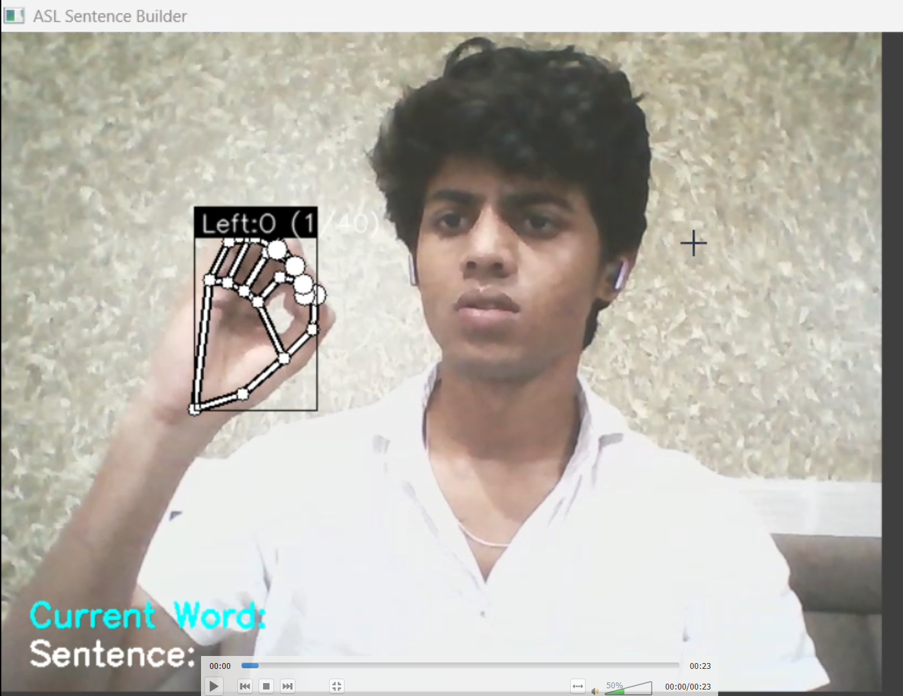
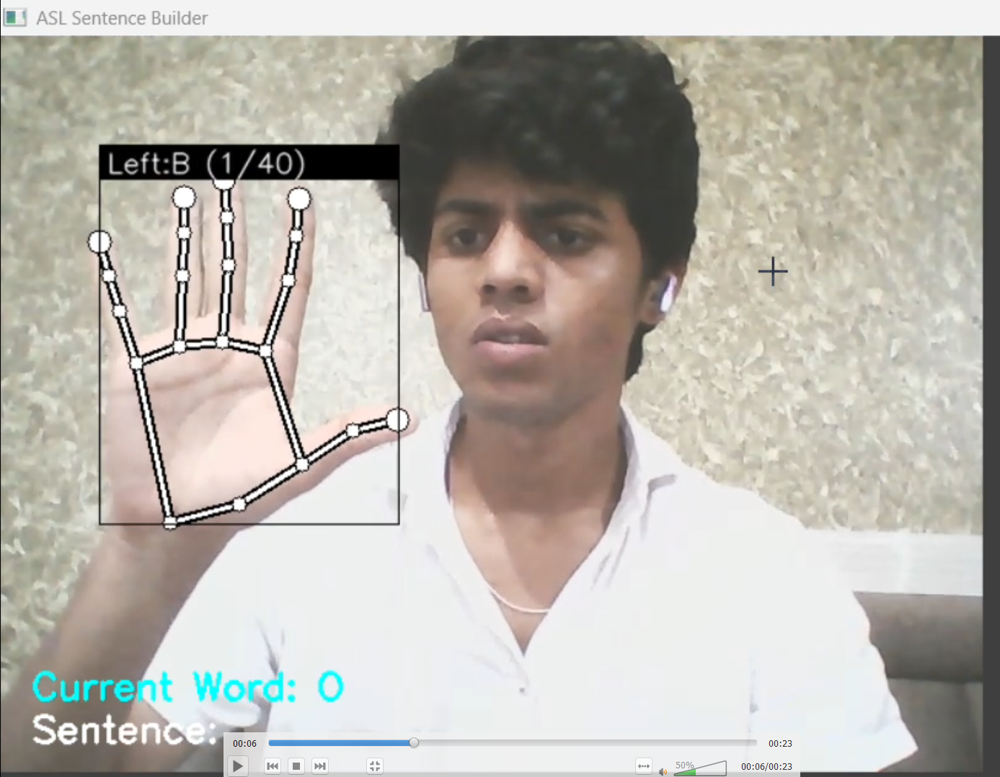
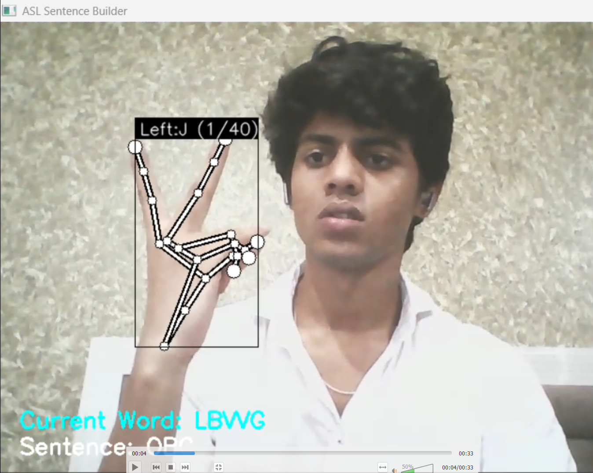
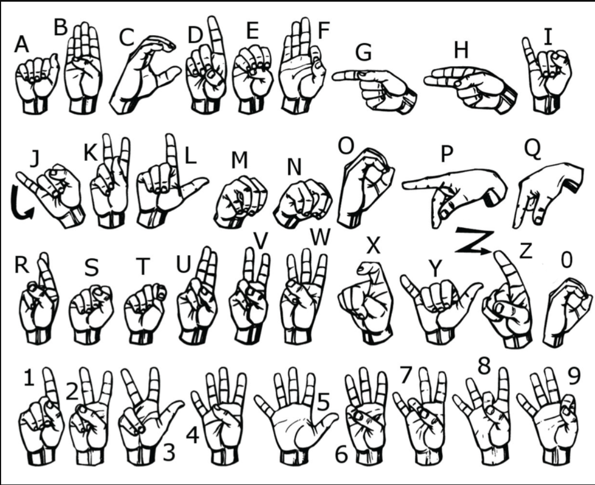

# ASL Sentence Builder

Real-time American Sign Language (ASL) recognition and sentence construction using computer vision and deep learning.

---

## 🚀 Project Overview
This project enables users to spell out words and build sentences in real time using American Sign Language gestures, captured via webcam. The system recognizes hand signs, constructs words and sentences, and can even speak them aloud using text-to-speech.

---

## ✨ Features
- Real-time ASL alphabet recognition from webcam
- Sentence and word construction with manual control
- Text-to-speech for recognized words and sentences
- Clean, minimal interface for easy demo and presentation

---

## 📸 Demo

### Video Demo

[](assets/demo.mp4)

### Screenshots
| ASL Recognition | Word Building | Letter Detection | ASL Alphabet Reference |
|:--------------:|:-------------:|:----------------:|:---------------------:|
|  |  |  |  |

---

## 🛠️ Setup & Installation
1. **Clone the repository:**
   ```bash
   git clone <your-repo-url>
   cd American-Sign-Language-Detection
   ```
2. **Install dependencies:**
   ```bash
   pip install -r requirements.txt
   ```
3. **(Optional) Download or place your demo video and images in the `assets/` folder.**

---

## 💡 Usage
- Run the main script:
  ```bash
  python app.py
  ```
- Show ASL gestures to your webcam.
- Press `SPACE` to complete a word, `ENTER` to complete a sentence, and `ESC` to exit.
- The recognized text will be displayed and spoken aloud.

---

## 🙌 Acknowledgements
- [MediaPipe](https://mediapipe.dev/)
- [gTTS](https://pypi.org/project/gTTS/)
- [OpenCV](https://opencv.org/)

---

## 📂 Assets
- Place your demo video as `assets/demo.mp4`.
- Place the provided images as `assets/image1.jpg`, `assets/image2.jpg`, `assets/image3.jpg`, `assets/image4.jpg`.

---

> **Made with ❤️ for accessible communication.** 